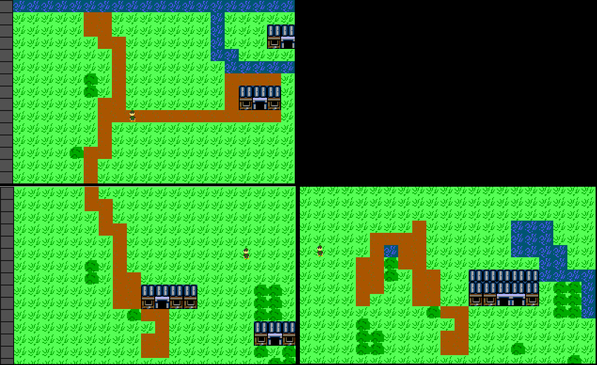

MyRPG
=====

An old walking demo of a Zelda-clone. 

I was digging through my old backup hard drive and found a walking demo of a Zelda clone I wrote back in '99. It's nothing special but it does showcase the use of one of the best tile engine tutorials I'd seen: 
http://www.petesqbsite.com/sections/tutorials/tutorials/rpg_tut1.txt
http://www.petesqbsite.com/sections/tutorials/tutorials/rpg_tut2.txt

You start on the top-left screen. The only other area "maps" built into the game at this time are the other two seen here, going down from the start and going right from there.

This code is under the GPLv3 license for anyone who wants to toy with it or learn from it. Happy coding!

